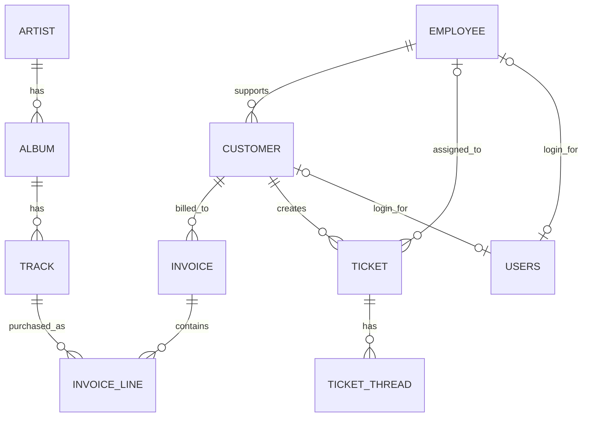

# RevaStudio ERD (Canonical)

## Metadata
- Source of truth (application): JPA entities in `server/src/main/java/com/revature/revastudio/entity`
- Source of truth (database): Flyway SQL in `server/src/main/resources/db/migration`
- Canonical database: PostgreSQL (AWS RDS in production)
- Last verified: 2026-03-06

## AI Parse Block
The following block is intentionally rigid for agent parsing.

```yaml
erd_version: 1
project: revastudio
database: postgresql
schemas:
  - public
entities:
  - name: artist
    pk: artist_id
  - name: album
    pk: album_id
  - name: track
    pk: track_id
  - name: customer
    pk: customer_id
  - name: employee
    pk: employee_id
  - name: invoice
    pk: invoice_id
  - name: invoice_line
    pk: invoice_line_id
  - name: users
    pk: id
  - name: ticket
    pk: ticket_id
  - name: ticket_thread
    pk: ticket_thread_id
relationships:
  - from: album.artist_id
    to: artist.artist_id
    cardinality: many-to-one
    optional: false
  - from: track.album_id
    to: album.album_id
    cardinality: many-to-one
    optional: true
  - from: customer.support_rep_id
    to: employee.employee_id
    cardinality: many-to-one
    optional: true
  - from: invoice.customer_id
    to: customer.customer_id
    cardinality: many-to-one
    optional: false
  - from: invoice_line.invoice_id
    to: invoice.invoice_id
    cardinality: many-to-one
    optional: false
  - from: invoice_line.track_id
    to: track.track_id
    cardinality: many-to-one
    optional: false
  - from: users.employee_id
    to: employee.employee_id
    cardinality: one-to-one-intended
    optional: true
    enforced_unique: false
  - from: users.customer_id
    to: customer.customer_id
    cardinality: one-to-one-intended
    optional: true
    enforced_unique: false
  - from: ticket.customer_id
    to: customer.customer_id
    cardinality: many-to-one
    optional: false
  - from: ticket.employee_id
    to: employee.employee_id
    cardinality: many-to-one
    optional: true
  - from: ticket_thread.ticket_id
    to: ticket.ticket_id
    cardinality: many-to-one
    optional: false
    on_delete: cascade
notes:
  - "users.employee_id and users.customer_id are modeled as @OneToOne in JPA but are not UNIQUE in migration V2__users.sql."
  - "ticket.customer_id is nullable in V3__ticket.sql but marked nullable=false in Ticket entity."
```

## Human Summary
- Artist 1 -> many Album
- Album 1 -> many Track
- Employee 1 -> many Customer (support representative)
- Customer 1 -> many Invoice
- Invoice 1 -> many InvoiceLine
- Track 1 -> many InvoiceLine
- Customer 1 -> many Ticket
- Employee 1 -> many Ticket (assignment optional)
- Ticket 1 -> many TicketThread (cascade delete)
- User <-> Employee and User <-> Customer are modeled 1:1 in code, but DB uniqueness is not enforced

## Mermaid ERD


## Verification Sources
- `server/src/main/java/com/revature/revastudio/entity/*.java`
- `server/src/main/resources/db/migration/V2__users.sql`
- `server/src/main/resources/db/migration/V3__ticket.sql`
